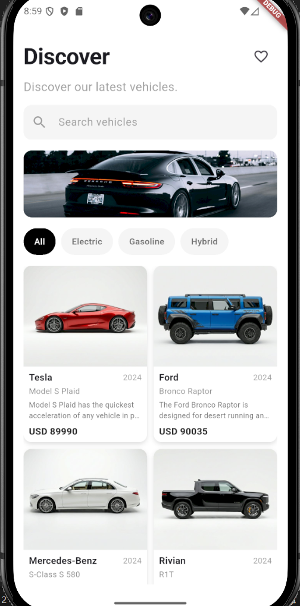
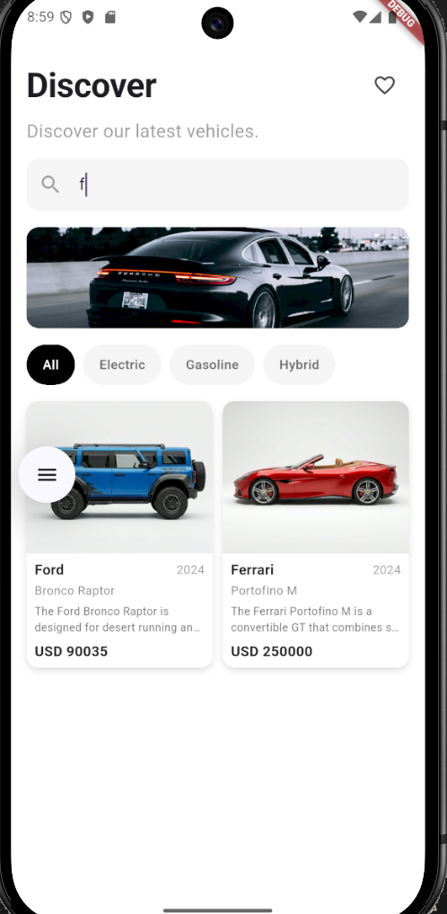
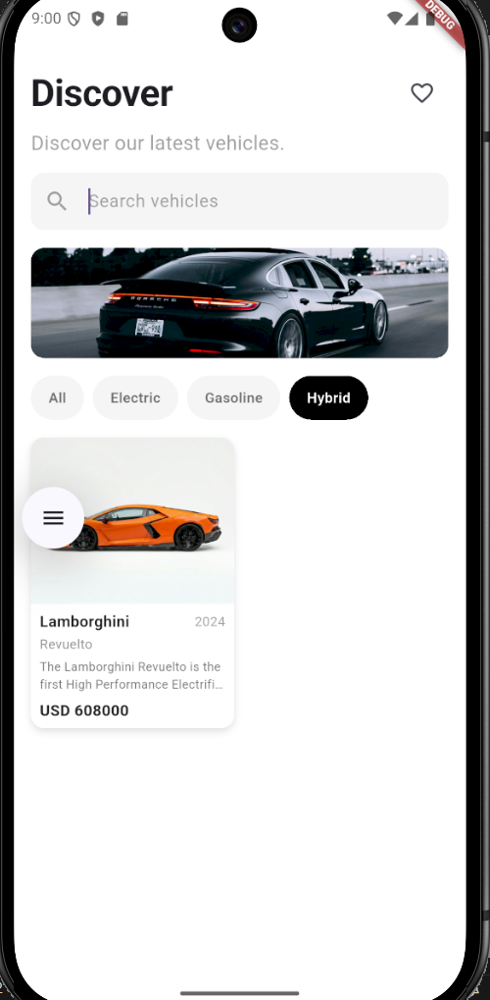
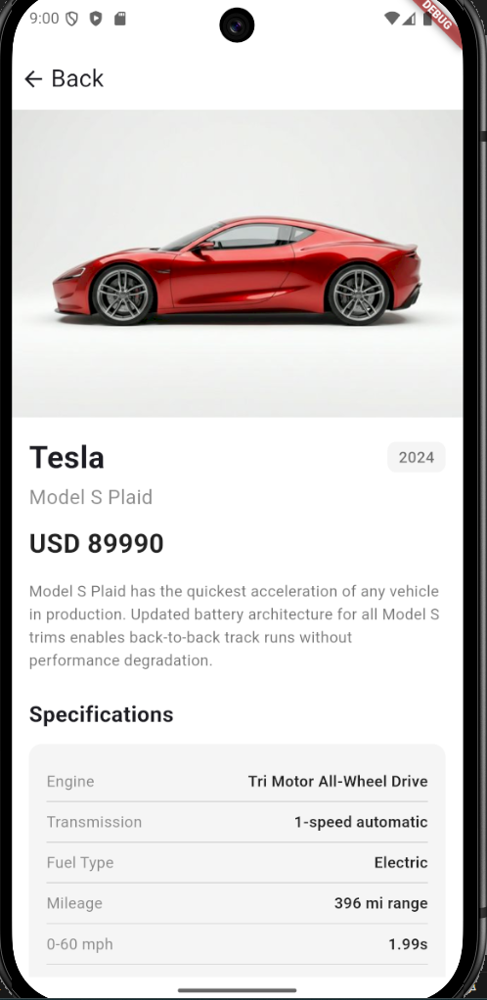
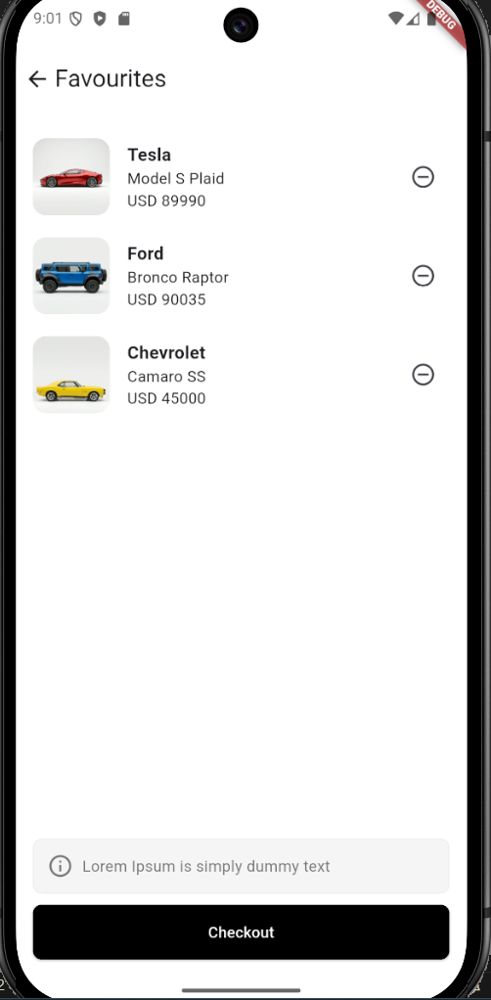
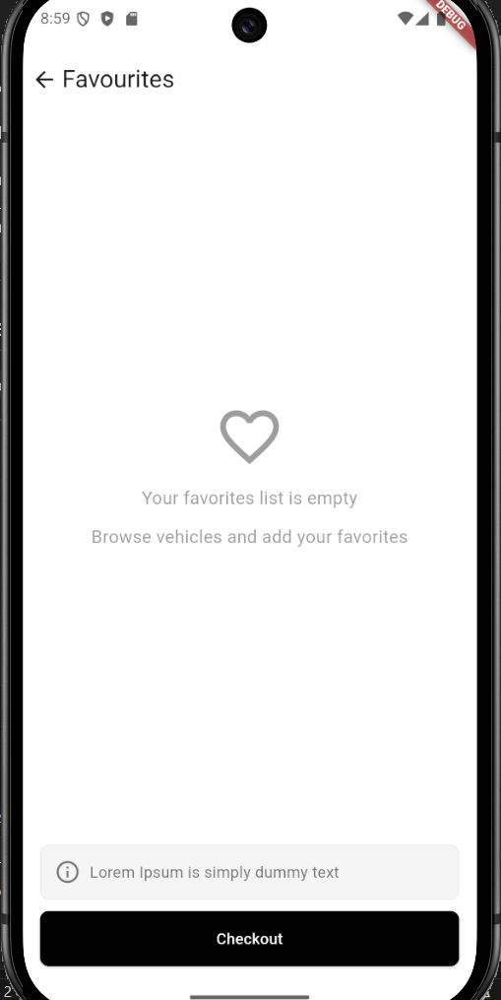

# AutoDiscover

Flutter ile geliştirilmiş modern bir araç keşif ve listeleme uygulaması. Kullanıcılar araçları listeleyebilir, yakıt tipine göre filtreleyebilir, detaylarını inceleyebilir ve favorilerine ekleyebilir.

---

## Özellikler

- Araç listeleme 
- Marka adına göre arama
- Yakıt tipine göre filtreleme
- Araç detay sayfası 
- Favoriler ekranı

---

## Kullanılan Teknolojiler

| Teknoloji | Versiyon |
|-----------|----------|
| Flutter   | 3.41.3   |
| Dart      | 3.11.1   |


---

## Çalıştırma Adımları

### 1. Repoyu Klonlayın

```bash
git clone https://github.com/BerkeKara00/flutter-vehicle-app.git
cd vehicle_app
```

### 2. Bağımlılıkları Yükleyin

```bash
flutter pub get
```

### 3. Bir Cihaz veya Emülatör Başlatın

Bağlı cihazları listelemek için:

```bash
flutter devices
```

### 4. Uygulamayı Çalıştırın

```bash
flutter run
```

Belirli bir cihazda çalıştırmak için:

```bash
flutter run -d 
```

### 5. Release Build

```bash
# Android
flutter build apk --release

# iOS
flutter build ios --release
```

---

## 📁 Proje Yapısı

```
lib/
├── main.dart
├── model/
│   └── vehicle_model.dart
├── services/
│   └── api_service.dart
├── components/
│   └── vehicle_card.dart
└── views/
    ├── home_screen.dart
    ├── vehicle_detail_screen.dart
    └── cart_screen.dart
```

---

## 📸 Ekran Görüntüleri


<table>
  <tr>
    <td align="center"><br/><sub>Home Screen</sub></td>
    <td align="center"><br/><sub>Search</sub></td>
  </tr>
  <tr>
    <td align="center"><br/><sub>Filter</sub></td>
    <td align="center"><br/><sub>Detail Screen</sub></td>
  </tr>
  <tr>
    <td align="center"><br/><sub>Favourites</sub></td>
    <td align="center"><br/><sub>Favourites Empty</sub></td>
  </tr>
</table>

---

